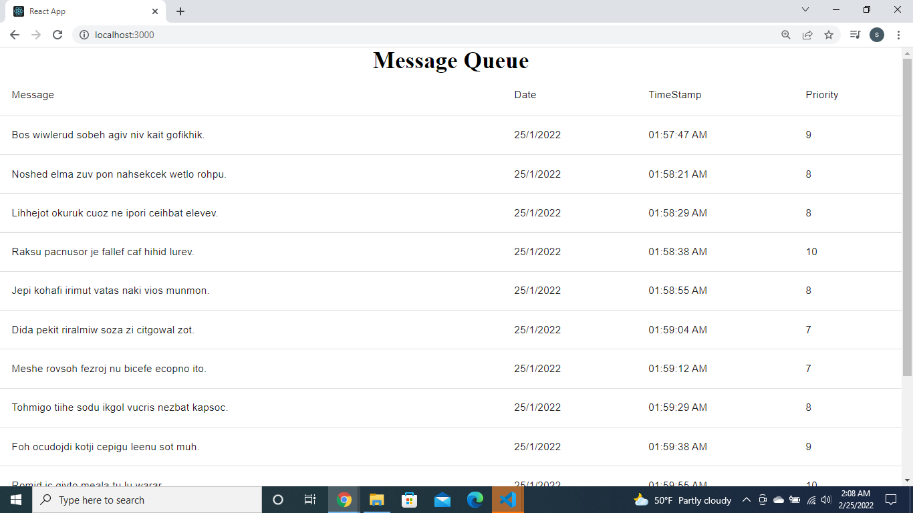

# message-queue

- Pre-requirements
  - ` Node.js LTS`
  - `RabbitMQ`
    Installed in the computer.
- cd into cloned directory.

- You can find three directories:

  - **frontend** : contains frontend of the application

  - **backend** : contains the backend code with two directories
    _ **receiver** : contains backend code for the subscriber
    _ **sender** : contains backend code for the publisher

- cd into each of the above mentioned directories in seperate terminal and,

  - Install require dependencies:
    `npm install`
  - Start the server:
    `npm start`

- Open `http://localhost:3000` in browser, and you can see the messages.

  - RabbitMQ is used as the message broker in this system.
  - The publisher publishes the 20 random messages per second and push them into queue. Each message is of format :
    ```
    {
      message : phrase generated from library,
      timestamp: time when the phrase is generated,
      priority: random number between 1 and 10
    }
    ```
  - The subscriber server reads from the message queue and takes the messages. Subscriber filters for the message having priority >= 7 and push those messages into Socket.IO .
  - The client is the react application. It contains socket.io-client library which takes the messages send from subscriber server and displays them into a table.
  - Here, RabbitMQ acts as the message broker. RabbitMQ is Advanced Message Queuing Protocol. It takes the data from publisher and stores it to queue. Whenever the subscriber or receiver need the data, it takes data from queue.


